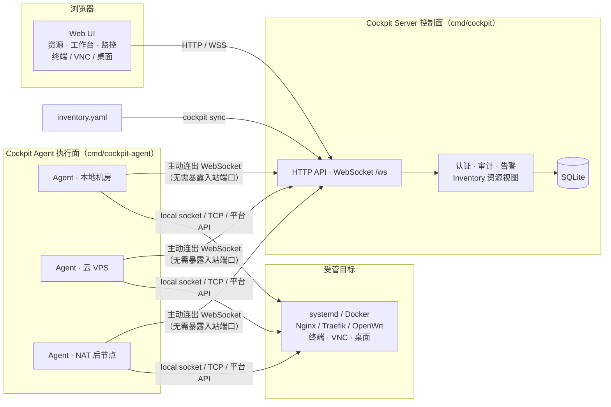

# Cockpit

个人混合基础设施控制台，用于把分散在本地机房、云 VPS、NAT 后节点上的资源收敛到一个轻量 Server + Agent 控制面。

[](https://github.com/cuihairu/cockpit/actions/workflows/test.yml)
[](https://github.com/cuihairu/cockpit/actions/workflows/docs.yml)
[](https://codecov.io/gh/cuihairu/cockpit)

## 当前能力

- **控制面基础**：Server 提供 Web UI、HTTP API、Agent WebSocket 接入、TOTP 两步验证、RBAC 用户/角色、审计日志与 SQLite 持久化；Agent 主动连出注册，上报心跳、系统指标与能力标签，NAT 后节点无需暴露入站端口。
- **资源视图**：`cockpit sync` 把 Inventory YAML 同步为运行时资源视图（计算实例、域名、证书、服务、网关、存储），资源行带拨测心跳条与到期告警。
- **远程操作**：终端 / VNC / 桌面经短期 ticket 转发，支持会话录制归档；agent 文件浏览与传输；journalctl / Docker 日志尾随与跨机联邦检索。
- **容器与应用**：Docker 容器/镜像/网络/卷管理；Stacks 按 compose 部署应用（模板库、部署历史、restart/pull 动作）。
- **备份恢复**：agent 侧定时打包、保留策略、双阶段安全恢复、rclone 异地推送与补传；server 侧面板数据库定时备份（`VACUUM INTO` + 异地推送）。
- **Web 与证书**：反向代理站点管理（nginx / Traefik 双后端，语法自检、失败回滚）；ACME 证书签发与自动续期（Cloudflare / DNSPod / 阿里云 DNS-01），签发产物自动部署到 agent 指定路径。
- **域名与 DNS**：多厂商 DNS 记录管理（Cloudflare / DNSPod / 阿里云，A/AAAA/CNAME/TXT/MX/CAA/SRV）、DDNS 动态域名、域名与证书到期台账。
- **主机运维**：服务管理（systemd / Windows SCM / macOS launchd 三后端）、Cron 定时任务、SMART 磁盘健康巡检、NAS 观测（DSM / TrueNAS / OMV、mdadm / ZFS）、组网观测（WireGuard / ZeroTier / Tailscale / frp 运行态与云端纳管）。
- **漂移与告警**：配置漂移检测与 CMDB 对照；告警通知多渠道（Herald / ntfy / webhook / Telegram）。

## 架构



Server 是中心控制面，Agent 是节点侧执行面。Agent 主动连出，所以 NAT 后节点不需要暴露入站端口。

## 快速开始

构建二进制：

```bash
go build -o cockpit ./cmd/cockpit
go build -o cockpit-agent ./cmd/cockpit-agent
```

构建 Web UI：

```bash
cd web
pnpm install
pnpm build
cd ..
```

初始化并同步示例清单：

```bash
./cockpit init -example
./cockpit sync -config config/cockpit.yaml
```

启动 Server：

```bash
export ADMIN_PASSWORD='change-this-password'
./cockpit server -config config/cockpit.yaml
```

默认访问地址：

- Web UI: `http://127.0.0.1:9000`
- Health: `http://127.0.0.1:9000/health`

启动 Agent：

```bash
./cockpit-agent start -server ws://127.0.0.1:9000/ws -region home -zone datacenter
```

也可以使用主二进制的兼容入口：

```bash
./cockpit agent -server ws://127.0.0.1:9000/ws -region home -zone datacenter
```

## 关键配置

默认配置路径优先级：

1. `-config` 指定路径
2. `./config/cockpit.yaml`
3. `./cockpit.yaml`
4. `/etc/cockpit/config.yaml`

生产环境至少设置：

```bash
export ADMIN_PASSWORD='use-a-strong-password'
export TOTP_ENCRYPTION_KEY="$(openssl rand -base64 32)"
export ALLOWED_ORIGINS="https://cockpit.example.com"
export PRODUCTION=true
```

对外部署时将 `server.host` 改为 `0.0.0.0`，并建议通过反向代理提供 HTTPS/WSS。

通知渠道（Herald / ntfy / webhook / Telegram）、DNS 与 ACME 凭据（Cloudflare / DNSPod / 阿里云）、组网云 token（ZeroTier / Tailscale）等完整键位见 [`config/cockpit.yaml`](config/cockpit.yaml) 内注释；密钥类配置建议用环境变量注入（`CLOUDFLARE_API_TOKEN`、`DNSPOD_LOGIN_TOKEN`、`ALIYUN_ACCESS_KEY`、`ZEROTIER_API_TOKEN`、`TAILSCALE_API_TOKEN` 等）。

Docker Compose 部署入口见 [deployments/docker/README.md](deployments/docker/README.md)。

## 端到端冒烟脚本

仓库内置一个最小闭环验证脚本，用于本地一键验证 server/agent/inventory sync/资源 API 链路是否正常：

```bash
./scripts/e2e-smoke.sh
```

Windows PowerShell:

```powershell
pwsh ./scripts/e2e-smoke.ps1
```

脚本行为：

1. 在临时目录创建最小 `cockpit.yaml` + `inventory.yaml`
2. 构建 `cockpit` 与 `cockpit-agent` 二进制
3. 启动 server，等待 `/health` 返回 ok
4. 启动 agent，等待 `/api/agents` 出现在线记录
5. 用 `cockpit sync` 同步 inventory，并验证 `/api/resources/{compute-instances,domains,certificates,services,gateways,storages}` 返回非空结果

退出码 0 表示全链路正常；非 0 时会自动打印 `server.log` 末尾用于排查。
保留日志便于调试：`E2E_KEEP_LOGS=1 ./scripts/e2e-smoke.sh` 或 `pwsh ./scripts/e2e-smoke.ps1 -KeepLogs`。

## 文档

- [介绍](https://cuihairu.github.io/cockpit/guide/introduction)
- [快速开始](https://cuihairu.github.io/cockpit/guide/getting-started)
- [架构与边界](https://cuihairu.github.io/cockpit/guide/architecture)
- [协议与 API 边界](https://cuihairu.github.io/cockpit/guide/protocol)

## 许可证

Apache License 2.0
