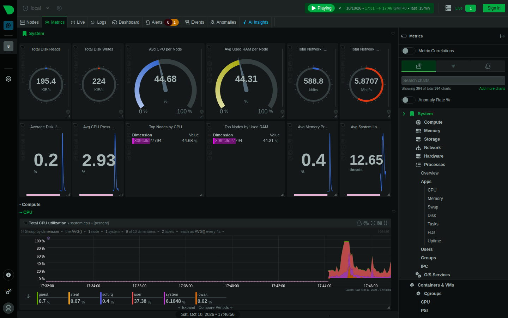
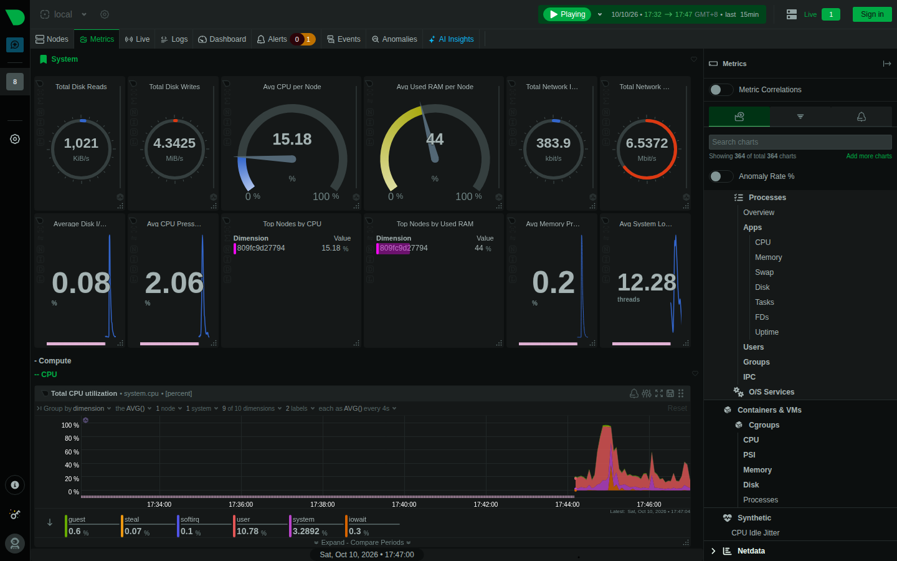
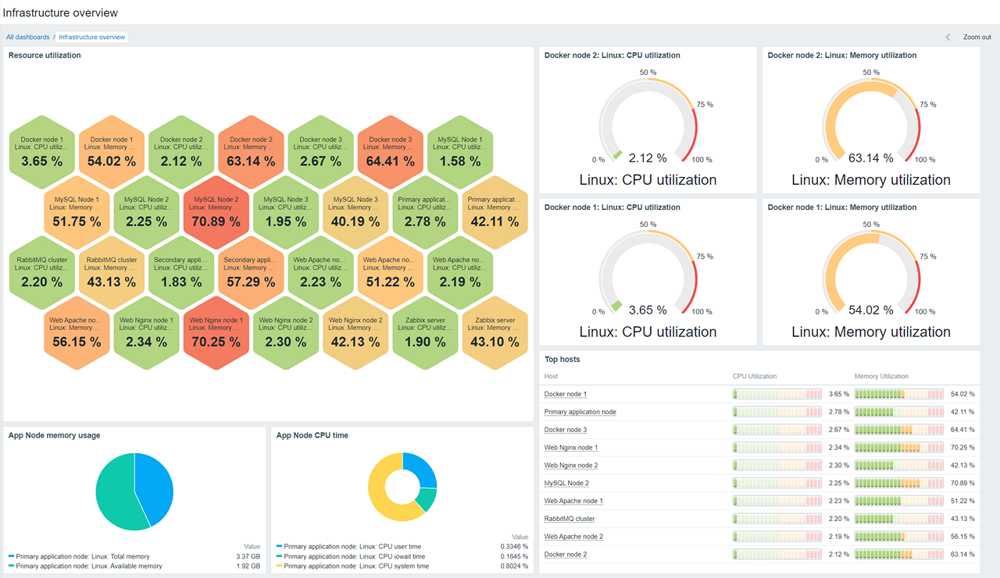
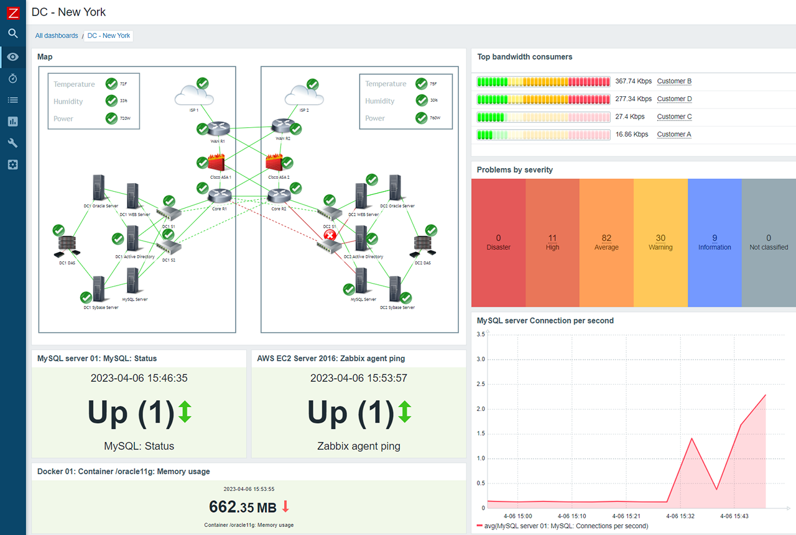
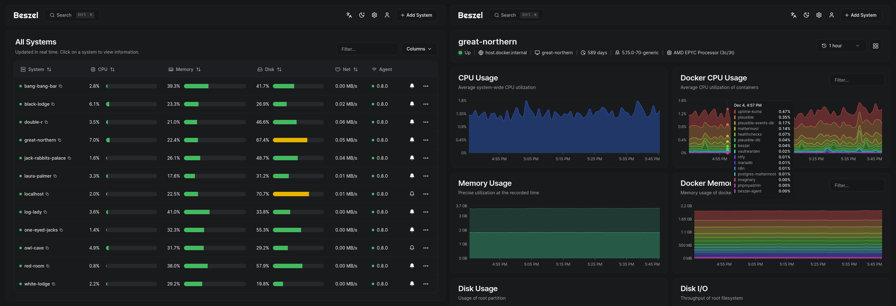
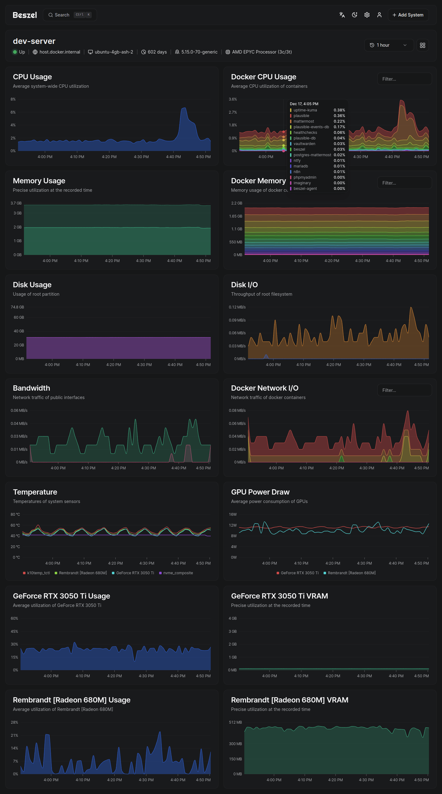
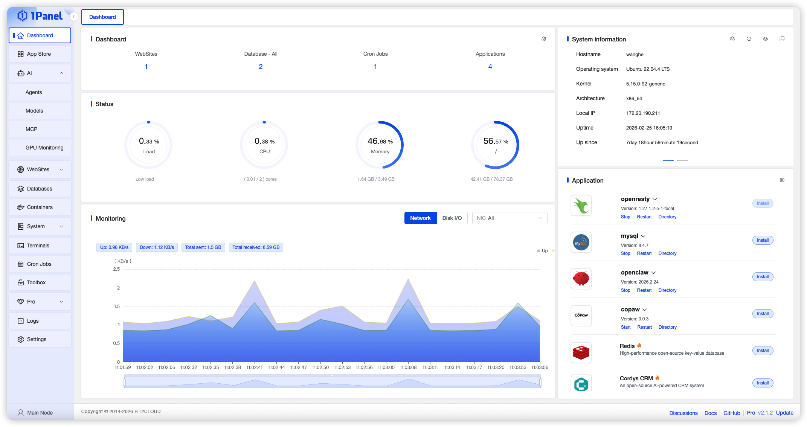
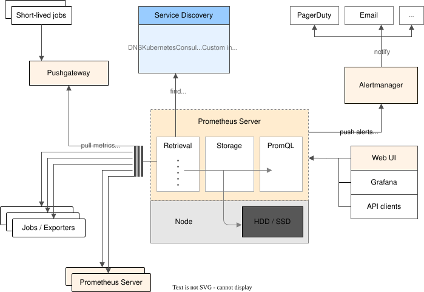
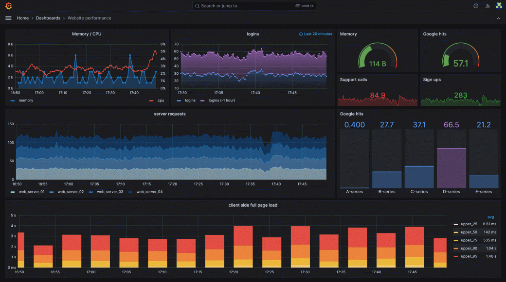

# 运维开源方案调研（监控面板 / 探活采集）

本文按调研四件套口径（截图内嵌 + 来源 + 可参考分析 + 挂导航）记录六家同类开源方案的对照结论，落点回答一个悬置问题：**Cockpit 的探活采集该自研，还是对接现成数据源（Prometheus / Netdata Provider）**。

调研时点 2026-10-10。截图以官网 / 官方文档 / 官方 README 提供的真界面图为主，Netdata 两张为本机容器实截。定性对比见 [参考项目对比与借鉴](/guide/reference-projects)（2026-09，含 Komodo/Portainer/Guacamole/Teleport/NetBox/Uptime Kuma），本文不重复其结论，只补监控面板六家与采集路线裁决。

## 总览

| 方案 | 定位 | 架构 | 对 Cockpit 的一句话结论 |
| --- | --- | --- | --- |
| Netdata | 每秒级单机全量指标 + 内置告警 | agent（C/Go）+ 可选云面 | 可借鉴「零配置开箱即用」；不引入其 agent 做采集底座 |
| Zabbix | 企业级舰队监控（模板/SNMP/拓扑图） | server + proxy + DB（PHP/Java） | 整体不适用（过重）；模板化与多点位拓扑值得对照 |
| Beszel | 轻量 homelab 监控 | hub + agent（Go，与 Cockpit 同构） | 可参考（前次调研已对标）；agent 资源基线仍是硬指标 |
| 1Panel | 单机 Linux 服务器管理面板 | 本机直装（Go + Vue，无 agent） | 可借鉴信息架构（设置页分组、应用商店模板） |
| Coolify | 自托管 PaaS（git→build→部署） | Docker/SSH 编排（单机或多机） | 可借鉴部署流水线交互；不整体引入（与控制面定位不同） |
| Prometheus + Grafana | 指标事实标准 + 可视化 | pull 采集 + TSDB + 独立展示层 | 可参考对接标准；指标面向其格式对齐，探活仍自研 |

## ① Netdata（agent / 秒级指标 / 告警）

开源 agent（GPLv3，C/Go），单机装完即自动发现服务并开始每秒采集，无需配置；健康面内置告警表达式与通知，v2 起 web 仪表盘自带异常检测（ML）与 AI 解读入口；云面（netdata.cloud）可关，匿名进本机仪表盘。

来源：本机 Docker 容器（`netdata/netdata`，127.0.0.1:19999，v2.12.0-nightly）Playwright 实截，2026-10-10。实截单容器节点即自动出 6092 条指标、364 张图表。

**可参考**

- 首屏体验：打开即有答案——gauge 首屏（CPU/RAM/磁盘/网络）+ 节点表 + 图表导航。Cockpit web 总览页可按此组织「一屏读懂基础设施」。
- 自动发现：agent 起来就知道机器上跑了什么并自动建图。Cockpit agent 的服务发现/drift 面可对标这种「不填配置就出数据」的默认值设计。

**可借鉴**

- 采集-保留分层（dbengine 多 tier，秒级近线 + 降采样远线）：Cockpit 指标面将来若落 SQLite 存储，降采样分层直接参照此模型。
- 告警内嵌在采集层（表达式 + 连续窗口判故障），与 croupier 探针 agent 的 threshold/recovery 防抖同构，验证了「窗口判稳」是通用口径。

**不适用（作为采集底座）**

- 为什么：per-second 全量采集的代价是常驻数百 MB 内存；云面闭源，匿名模式每次进面板都要过 sign-in 门（本次实截需手动 skip）；把「个人混合基础设施」里每台机器都换成 netdata agent，等于把 Cockpit 的采集面外包给一个自带控制面的第三方。
- 落点：不引入；只保留「对接其 Prometheus 端点」的通路（见文末裁决）。

## ② Zabbix（舰队监控 / 模板 / SNMP）

企业级监控事实标准之一：server + proxy + 独立 DB，模板库标准化监控项，SNMP/IPMI/agent 多协议采集，可视化含仪表盘与网络拓扑图。

来源：[zabbix.com/product](https://www.zabbix.com/product) 官网产品页（assets.zabbix.com），2026-10-10 下载。

**可参考**

- 多点位拓扑（proxy 分层采集、拓扑图聚合展示）：croupier「多点位归属另议」悬置的正是这个能力，Zabbix 的 proxy 树 + map 是最完整的业界参照——点位 agent 采集、聚合层归并、拓扑图呈现三层分离。
- SNMP/无 agent 采集对「混合基础设施」的意义：交换机/路由器/NAS 这类装不了 agent 的设备只有 SNMP/ICMP 可用，Cockpit 的 OpenWrt/NAS 线将来绕不开。

**可借鉴**

- 监控项模板化：一类设备一套模板（标准 item + trigger），主机挂模板即得监控。Cockpit 服务检测的 probe.yaml 目标格式可长出「模板/预设」层，避免每台手写 targets。

**不适用（整体引入）**

- 为什么：PHP/Java server + 独立 DB 的重型架构，运行成本与运维面远超个人基础设施的量级；其配置面（host group/item/trigger 三层抽象）对单人使用是纯摩擦。
- 落点：不引入；只吸收模板化与多点位拓扑两个设计。

## ③ Beszel（轻量 agent）

hub + agent 双件套（MIT，Go），与 Cockpit Server + Agent 同构；agent 约 23MB 内存，Docker 容器级 stats、历史曲线、告警齐全。前次调研（[参考项目对比](/guide/reference-projects)）已作监控域主对标。

来源：官方 CDN/官网（henrygd-assets.b-cdn.net、beszel.dev），2026-10-10 下载。

**可参考**

- agent 轻量硬指标：23MB 内存基线是 Cockpit Agent 的对照线，agent 体积回归应进验收清单。
- hub-agent 通信零配置（SSH 隧道免证书管理）：Cockpit 已走主动出站 WebSocket，方向一致，无需动。

**可借鉴**

- 单二进制 + 默认可用：agent 装完不需要先在 server 注册界面点一圈。
- 历史数据紧凑存储：PocketBase 之外自管降采样，SQLite 路线的 Cockpit 可研究其表结构与降采样节奏。

**不适用（作为底座）**

- 为什么：只读监控，无 CMDB/远控/管理动作，数据模型固定；引入它等于在 Cockpit 旁边再养一个控制面。
- 落点：不引入；作为 agent 资源占用的对标标尺长期有效。

## ④ 1Panel（面板 + 设置页分组）

飞致云出品的单机 Linux 服务器面板（Go + Vue，2026-10 时点约 36k★）：网站/数据库/容器/计划任务/文件管理分组导航，应用商店一键装应用。

来源：[resource.1panel.pro](https://resource.1panel.pro/img/overview_en_v2.png) 官方资源站，2026-10-10 下载。

**可参考**

- 信息架构：左侧一级分组（概览/网站/数据库/容器/计划任务/文件/设置）+ 每组内操作台。Cockpit web 导航可对照其分组粒度——特别是「设置页分组」（面板设置/服务器设置/安全/关于分块），Cockpit 设置面扩展时按此分层。
- 应用商店的声明式模板：每个 app 一份 metadata（名称/变量/端口/compose），商店只渲染模板。Cockpit stack-deploy 的模板字段设计可对照其 schema。

**可借鉴**

- 「服务器运维动作面板化」：把 systemctl/防火墙/计划任务这类 CLI 动作收进表单 + 确认 + 审计的交互范式，与 Cockpit 服务/防火墙/计划任务页同构，可对照补缺。

**不适用（整体引入）**

- 为什么：单机直装（无 agent、无舰队视图），无 CMDB/远控面；它是「一台服务器的运维面板」，Cockpit 是「一组机器的控制台」，定位不同层。
- 落点：不引入；吸收 IA 分组与 app 模板 schema 两个设计。

## ⑤ Coolify（自托管 PaaS）

开源 Heroku/Netlify 替代（Apache-2.0，2026-10 时点约 55k★）：git 推送 → 构建 → 发布的部署流水线，一键应用模板（含各类数据库），Traefik 反代自动接线，环境变量/备份/日志面齐全。

来源：[coolify.io/docs](https://coolify.io/docs) 官方文档（deploy-first-app/deploy-first-db），2026-10-10 下载。

**可参考**

- 部署流水线的交互拆解：选源 → 配环境变量 → 实时构建日志流 → 版本/回滚。Cockpit stack-deploy 走 Job/Workflow 编排后，前端部署详情页可按此组织（部署即 Job，日志流对 Job 输出）。
- Traefik 接线方式：Coolify 用 label/file provider 自动注册路由，与 Cockpit traefik file provider 热加载路线同款，验证了该路线的工程成熟度。

**可借鉴**

- 「一键模板 + 少量必填」的应用创建体验：默认值给足，高级项折叠。
- 数据库类应用的模板化（端口/凭据/备份三件套自动配好）。

**不适用（整体引入）**

- 为什么：PaaS 全家桶自带 build 链（Dockerfile/Compose/Nixpacks 生成）与发布面，与 Cockpit「控制面编排、不重造底层」的边界纪律冲突——引入它等于在 Cockpit 里再嵌一个部署引擎。
- 落点：不引入；吸收部署交互与模板默认值设计，落到 stack-deploy。

## ⑥ Prometheus + Grafana（指标标准 + 可视化）

Prometheus：pull 模型指标采集事实标准（Apache-2.0），exporter 生态覆盖一切能吐 /metrics 的东西，PromQL 查询。Grafana：AGPL 可视化层，只读数据源、不建存储——「展示与存储分离」的边界教科书。

来源：architecture.svg 取自 [prometheus/prometheus 仓库官方文档图](https://github.com/prometheus/prometheus/blob/main/documentation/images/architecture.svg)；Grafana 图取自 grafana.com 官网（storyblok CDN）。2026-10-10 下载。

**可参考**

- pull 模型 + /metrics 端点：任何组件暴露标准端点即可被整个生态消费。Cockpit agent 将来暴露 /metrics 是零成本接入该生态的通路。
- Grafana 的「只做展示不建存储」：与 Cockpit「Control Plane 不重造底层」同一条边界纪律的先例——Grafana 靠数据源插件接一切，Cockpit 靠 Provider 接底层。

**可借鉴**

- 仪表盘布局语言：row/panel/variable 三层组织 + 时间范围全局联动，Cockpit web 图表面板按此建模。
- exporter 各管一段的分工：node/docker/blackbox 各自独立进程互不耦合，Cockpit 的探测面（croupier probe agent）与资源采集面应保持同样的可拆性。

**不适用（全套自建引入个人基础设施）**

- 为什么：server + 长驻 TSDB + 告警管理器 + Grafana 四件套对个人量级是重的；但「格式与端点标准」不等于「必须全套自建」，两者要分开裁决（见下）。
- 落点：对齐格式（/metrics、PromQL 兼容查询留口），不强制全套部署。

## 特别回答：探活采集自研，还是对接现成数据源

悬置问题出自 [服务检测 agent 设计](/design/service-detect-agent)（croupier 口径）：B1-B6 已落地自研探针 agent（黑盒 http/tcp 探活、三态状态机、故障窗口、上行 REST），但「指标/探活数据是否改接现成数据源」未成文。两个候选 Provider 的评估：

**Prometheus Provider（对接 prometheus 生态）**

- 指标采集面：对接成立。exporter 生态成熟，pull 模型与 Cockpit「agent 主动出站」可经 agent 暴露 /metrics 或 server 侧 pull 兼容存储衔接；Netdata/Beszel/Zabbix 也都能吐或接 Prometheus 格式，等于一次性打通所有上游。
- 探活面：对接不成立。blackbox_exporter 只产出「探测值」这个数据点；三态状态机、threshold/recovery 防抖、故障窗口聚合、RBAC、审计、web 呈现全是控制面语义，接了数据源之后一样要自建——数据源解决不了控制面问题。

**Netdata Provider（对接 netdata 采集面）**

- per-second 全量指标是卖点，但代价是每台机器常驻数百 MB 内存的 agent，且其控制面（云）闭源；「把采集面外包给自带控制面的第三方」与 Cockpit Control Plane 定位相抵。
- 通路价值仅在于：netdata agent 自带 `/api/v1/allmetrics?format=prometheus` 端点，若用户机器上已有 netdata，Cockpit 可把它当一个普通 Prometheus 格式上游消费——按需兼容即可，不必立项「Netdata Provider」。

**裁决**

- 探活：**维持自研**。探活是控制面语义（状态机/窗口/审计），不是数据源问题；croupier probe agent B1-B6 已是落地实现，继续沿此路线（多点位等扩展见 croupier 口径）。
- 资源指标：**对齐 Prometheus 格式，不自研采集器**。agent/指标面将来暴露 /metrics、server 读面优先接 Prometheus 兼容格式；已有 netdata 的机器经 allmetrics 端点按需接入。
- 分界一句话：**探活自研（控制面），指标对齐生态（数据面）**。

## 与 croupier 设计的交叉引用

- [服务检测 agent（croupier system 角色探针）](/design/service-detect-agent)：B1-B6 自研探活即本文裁决的「探活自研」路线的落地；其「探测从 agent 侧发起、多点位归属另议」的悬置，业界参照即 Zabbix proxy 树（本文②）与 Netdata parent/streaming 拓扑（本文①）。
- [agent-core 架构](/design/agent-core-architecture)：探测专用产物复用同一份 core 零件，与 Beszel agent（本文③）「单二进制小内存」的量级对标是 agent 体积验收的标尺。
- [Workflow 与异步 Job](/guide/workflow-design)：Coolify 部署流水线（本文⑤）是「部署即 Job/Workflow」的交互参照。

## 来源

- Netdata：本机容器实截（netdata/netdata Docker 镜像，127.0.0.1:19999，v2.12.0-nightly，2026-10-10）
- Beszel：[henrygd-assets.b-cdn.net/beszel/screenshot-new.png](https://henrygd-assets.b-cdn.net/beszel/screenshot-new.png)、[beszel.dev/image/system-full.png](https://beszel.dev/image/system-full.png)
- 1Panel：[resource.1panel.pro/img/overview_en_v2.png](https://resource.1panel.pro/img/overview_en_v2.png)
- Zabbix：[assets.zabbix.com 产品页图](https://www.zabbix.com/product)（visualization_dashboards_honeycomb / network_map）
- Coolify：[coolify.io/docs 官方文档图](https://coolify.io/docs)（deploy-first-app / deploy-first-db）
- Grafana：[grafana.com 官网图](https://grafana.com/grafana/)（storyblok CDN）
- Prometheus：[官方仓库 architecture.svg](https://github.com/prometheus/prometheus/blob/main/documentation/images/architecture.svg)
